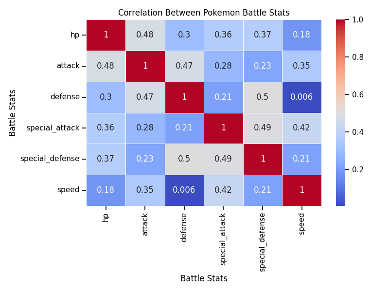
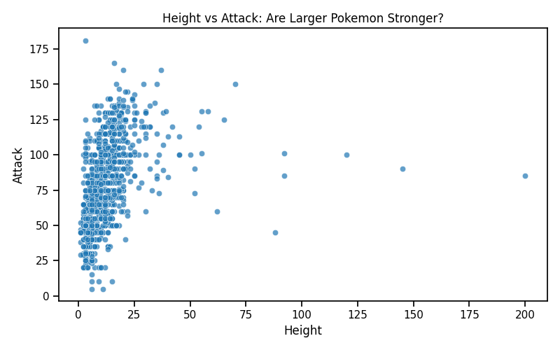
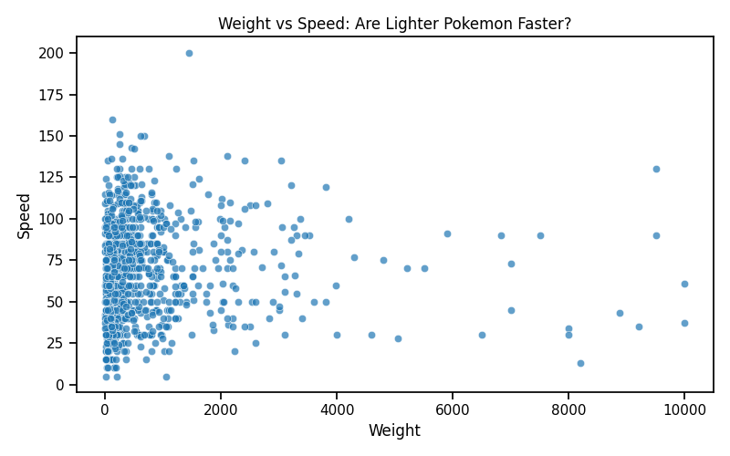
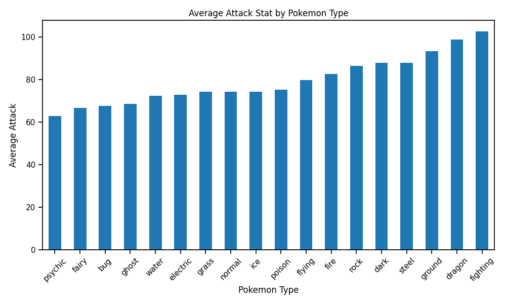
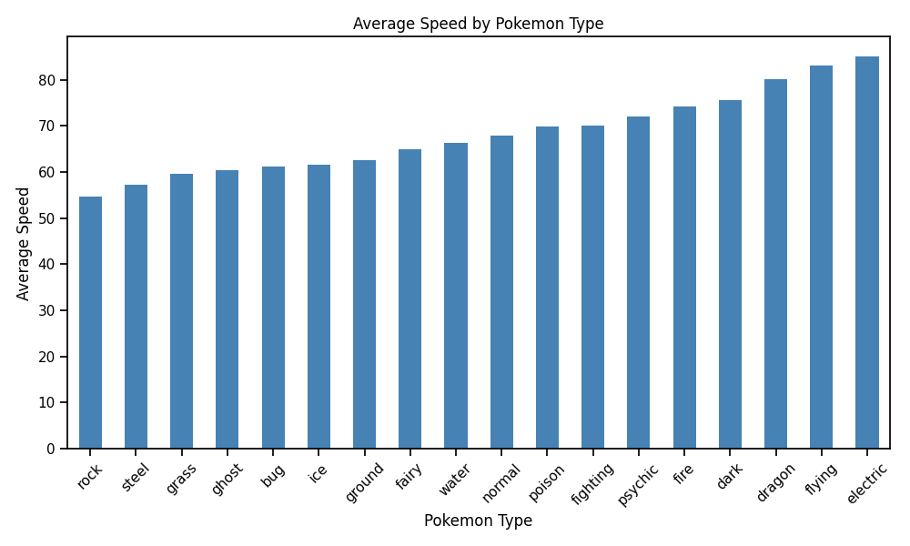
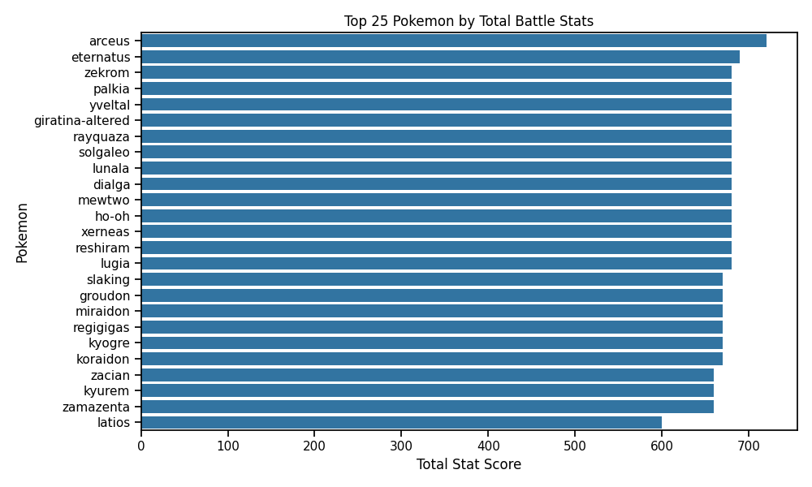

## Introduction

Pokémon battles are built around a variety of stats such as HP, attack, defense, and speed. While experienced players often talk about certain Pokémon being “tanky,” “fast,” or “high damage,” it is not always clear how these characteristics appear across the entire set of Pokémon. With over 1000 Pokémon available in the modern Pokédex, this dataset provides an interesting opportunity to explore patterns in their battle statistics.

In this project, I collected Pokémon data using a public API and explored how battle stats relate to one another and how they differ across Pokémon types. The goal is to identify patterns that might help explain how Pokémon are designed and how players might think about building a strong team.

---

## Motivating Questions

This analysis focuses on a few key questions:

- How are Pokémon battle stats related to one another?
- Do larger Pokémon tend to be stronger?
- Are certain Pokémon types better at specific stats such as attack or speed?
- What general patterns might be useful for players thinking about battle strategy?

Understanding these patterns can provide insight into how Pokémon roles (such as tanks, fast attackers, or balanced fighters) emerge from their stat distributions.

---

## Data Collection and Ethics

The data for this project was collected using the **PokéAPI**, a free and publicly available API designed for developers and researchers.

PokéAPI provides structured Pokémon data including physical attributes and battle statistics. Because the API is publicly accessible and designed for educational use, collecting this data is allowed under its terms of service.

To ensure good data collection practices:

- Requests were made sequentially rather than in parallel.
- A short delay was included between requests to avoid overloading the API.
- No authentication or private data was required.

More information about the API can be found at:

https://pokeapi.co/

---

## How the Dataset Was Created

The dataset was assembled using a Python script that queried the PokéAPI for each Pokémon entry. The script retrieved key attributes such as size, type, and battle statistics.

The general steps were:

1. Loop through Pokémon IDs using the PokéAPI endpoint
2. Request data for each Pokémon
3. Extract relevant fields from the JSON response
4. Store the results in a pandas DataFrame
5. Export the cleaned dataset as a CSV file

The full code for this process is available in the project GitHub repository:

**GitHub Repository:**  
https://github.com/dallinmj/pokemon

---

## Overview of the Dataset

The final dataset contains information for **1,024 Pokémon**, each with several attributes describing their size and battle capabilities.

### Dataset dimensions

- **Rows:** 1024 Pokémon  
- **Columns:** 11 variables

### Data dictionary

| Variable | Description |
|--------|-------------|
| id | Pokédex ID |
| name | Pokémon name |
| height | Pokémon height |
| weight | Pokémon weight |
| primary_type | Primary Pokémon type |
| hp | Hit Points (health) |
| attack | Physical attack stat |
| defense | Physical defense stat |
| special_attack | Special attack stat |
| special_defense | Special defense stat |
| speed | Speed stat |

These statistics are the base attributes used in Pokémon battles.

---

## Data Cleaning and Preparation

The raw API responses were structured JSON objects, so the main cleaning task involved extracting relevant fields and organizing them into a tabular format.

Key transformations included:

- Extracting nested stat values from the API response
- Selecting the Pokémon's primary type
- Converting the data into a pandas DataFrame
- Exporting the final dataset to CSV format

No missing values were observed for the battle statistics.

---

## Exploring Pokémon Battle Statistics

Before looking at specific relationships, it is useful to examine how battle stats relate to one another overall.

### Correlation Between Battle Stats

This heatmap shows the correlation between the six main battle statistics.

Most stat pairs have **moderate positive correlations**, meaning that stronger Pokémon often have multiple strong attributes rather than excelling in only one area.

However, none of the correlations exceed about **0.5**, suggesting that Pokémon are intentionally designed with diverse stat profiles. For example, speed shows almost no relationship with defense, meaning fast Pokémon are not consistently fragile or durable.

This diversity allows for different battle roles such as tanks, fast attackers, or balanced Pokémon.

---

## Are Larger Pokémon Stronger?

A common intuition is that larger Pokémon might also be stronger in battle.

This plot compares Pokémon height with attack stat.

While there is some upward trend, the relationship is fairly weak. Many smaller Pokémon have high attack values, and some very large Pokémon are not especially strong attackers.

This suggests that size alone is not a reliable predictor of battle strength.

---

## Speed vs Weight

Another interesting question is whether lighter Pokémon tend to be faster.

The data shows that many of the fastest Pokémon are relatively lightweight, although there are exceptions. Extremely heavy Pokémon are rarely among the fastest, which aligns with intuitive expectations about mobility.

---

## Differences Between Pokémon Types

Pokémon types show some of the most interesting patterns in battle statistics.

### Average Attack by Type

Fighting, dragon, and ground types tend to have the highest average attack stats, while psychic and fairy types tend to have lower physical attack.

This reflects common gameplay roles: fighting types are often designed as strong physical attackers.

---

### Average Speed by Type

Electric, flying, and dragon types tend to have the highest average speed, while rock and steel types are generally slower.

This aligns with intuitive design ideas: heavy rock or steel Pokémon often trade mobility for durability.

---

## The Strongest Pokémon Overall

One way to measure overall strength is to sum all battle stats.

The Pokémon with the highest total stats are mostly **legendary Pokémon**, such as Arceus, Eternatus, and Rayquaza.

This is expected, since legendary Pokémon are intentionally designed to be among the strongest in the game.

---

## Key Insights

Several patterns emerge from this dataset:

- Battle stats tend to be **moderately correlated**, but no stat strongly determines another.
- Larger Pokémon are **not necessarily stronger attackers**.
- Faster Pokémon tend to be **lighter and more agile types**.
- Certain types specialize in particular stats:
  - **Fighting and dragon types** often have high attack
  - **Electric and flying types** tend to be faster
  - **Rock and steel types** are slower but often defensive
- Legendary Pokémon dominate the highest total stat rankings.

These patterns suggest that Pokémon design encourages a variety of battle roles rather than a single dominant strategy.

---

## Limitations

While the dataset provides useful insights, there are several limitations:

- Only the **primary type** was used, even though many Pokémon have two types.
- Base stats do not capture all battle mechanics such as abilities, moves, or type advantages.
- Pokémon evolutions and alternate forms may affect stat distributions.

Future analysis could incorporate move sets, abilities, or type effectiveness.

---

## Conclusion

This project demonstrates how publicly available APIs can be used to build interesting datasets for exploratory analysis. By collecting and analyzing Pokémon battle statistics, we were able to identify patterns in stat relationships, type differences, and overall strength.

---

## Resources

PokéAPI  
https://pokeapi.co/

Project GitHub Repository  
https://github.com/dallinmj/pokemon